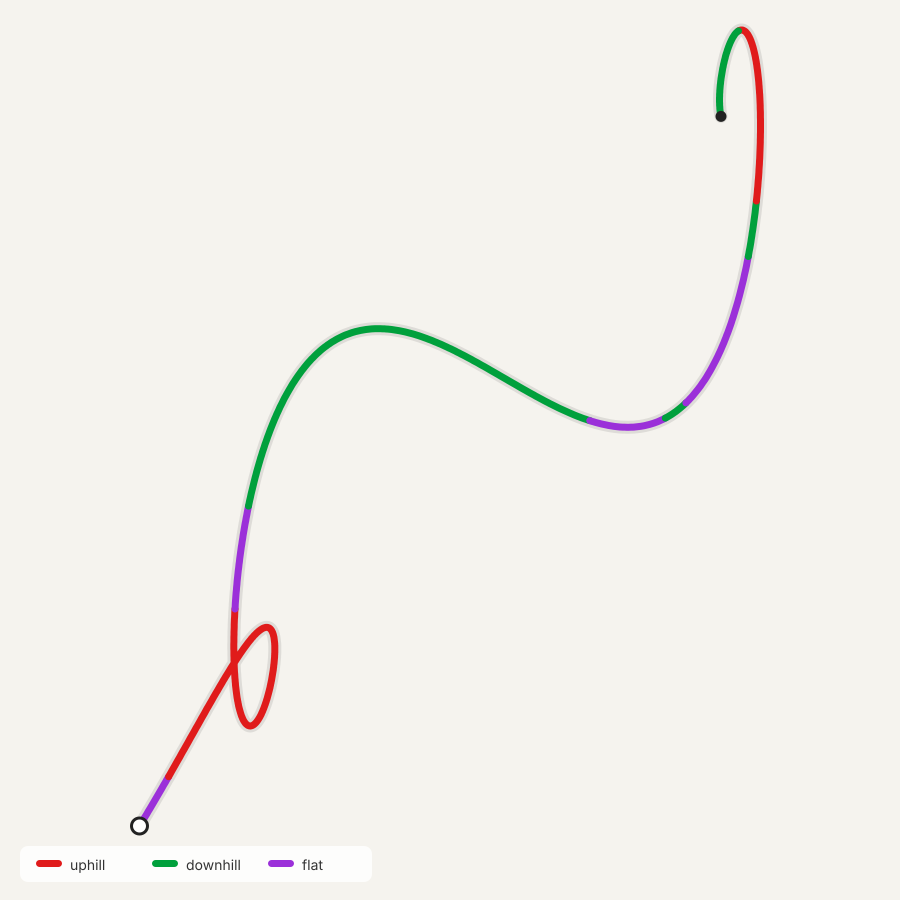
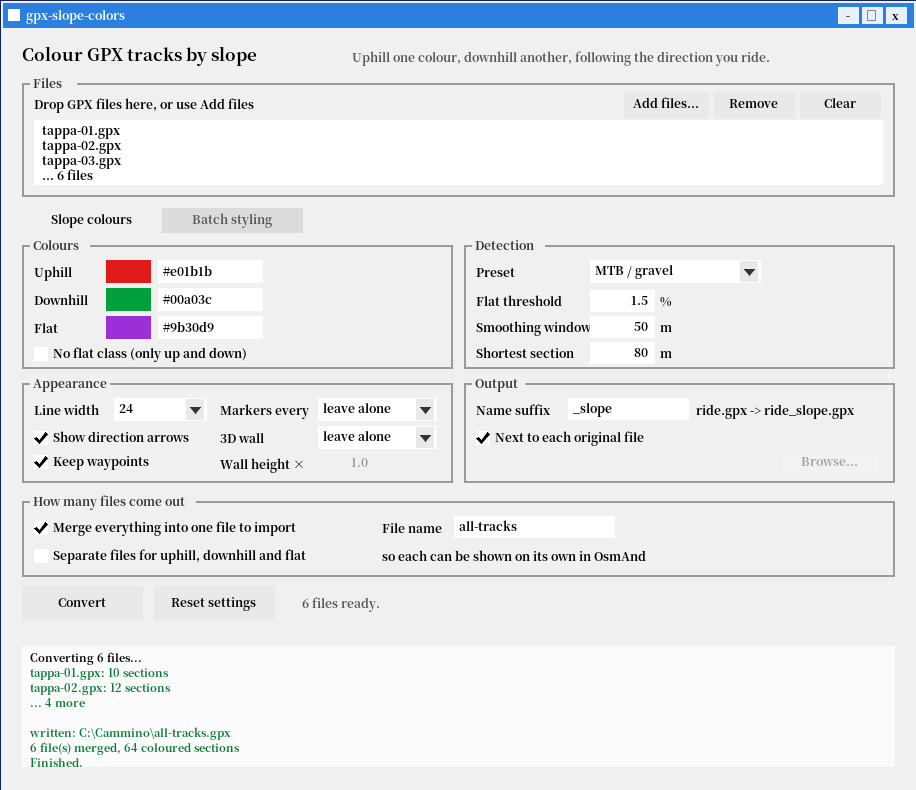

<div align="center">

# gpx-slope-colors

**Colour a GPX track by slope — climbs one colour, descents another —
following the direction you actually travel.**

Works in **OsmAnd** (no Pro subscription) and on **Garmin**.
One self-contained executable. No Python, no runtime, no installer.

[](LICENSE)
[](#building-from-source)
[](#tests-and-verification)
[](#installing)



</div>

---

## Why

OsmAnd can colour a track by slope natively, and it does it properly: the
gradient is *signed*, so uphill and downhill are told apart rather than just
"steep vs flat". The catch is that this colouring mode is reserved for
**OsmAnd Pro**.

This tool does the same job from the outside. It reads your GPX, works out
where you are climbing and where you are descending — following the order of
the points, so the result depends on the direction you ride or walk — and
writes the colours *into* the file. Free OsmAnd displays them without
complaint, because per-track colours in a GPX have never been a paid feature.

The track is cut into consecutive `<trk>` blocks, each carrying its own colour.
A useful side effect: because every block is a solid colour, **the direction
arrows stay visible** — they disappear with OsmAnd's own gradient colouring
([issue #21082](https://github.com/osmandapp/OsmAnd/issues/21082)).

## Installing

Grab a build from the [Releases](../../releases) page, or build it yourself —
it takes about five seconds and needs nothing but a C++17 compiler.

| File | Platform |
|---|---|
| `gpx-slope-colors.exe` | Windows app — drag, drop, Convert |
| `gpx-slope-colors-cli.exe` | Windows command line |
| `gpx-slope-colors` | Linux / macOS command line (build from source) |

The Windows executables are statically linked: no DLLs, no admin rights, no
setup program. They run from a USB stick.

## Quick start

```sh
gpx-slope-colors ride.gpx
```

writes `ride_slope.gpx` next to the original — climbs in red, descents in
green, level ground in purple.

Then in OsmAnd: *Menu → My Places → Tracks → Import*, and show the track on
the map. There is nothing to configure inside OsmAnd; the colours travel
inside the file.

A sample track is included if you want to try it straight away:

```sh
gpx-slope-colors demo.gpx
```

### The Windows app

Double-click the `.exe`, drag your GPX files onto the window, press
**Convert**. You can also drop files straight onto the icon, or right-click a
GPX file and pick *Open with*. Presets for road cycling, MTB, hiking and long
routes set sensible values in one click.



## Options

Everything is optional; the defaults are tuned for cycling.

```
  -h, --help             show this help and exit
  -o, --output PATH      output file (single input only; default: next to
                         the input file, with the suffix added)
      --output-dir DIR   write results into DIR instead
      --suffix TEXT      suffix added to the name (default _slope)
      --threshold PCT    gradient % below which a stretch is flat (1.5)
      --window M         metres for smoothing and gradient (50)
      --minlen M         shortest coloured section in metres (80)
      --uphill COLOR     uphill colour: name or #rrggbb (red)
      --downhill COLOR   downhill colour (green)
      --flat COLOR       flat colour (purple)
      --no-flat          no flat class: everything is uphill or downhill
      --split-files      one file per class instead of a single one
      --width W          thin | medium | bold | 1-24 (24 = maximum)
      --no-arrows        do not show direction arrows
      --keep-waypoints   copy <wpt> waypoints into the output
      --quiet            print errors only
      --colors           list the colour names and exit
      --version          print the version and exit
```

### Examples

```sh
# all defaults -> ride_slope.gpx
gpx-slope-colors ride.gpx

# pick the output name
gpx-slope-colors ride.gpx -o coloured.gpx

# a different suffix -> ride_osmand.gpx
gpx-slope-colors ride.gpx --suffix _osmand

# colours by name, or by hex code
gpx-slope-colors ride.gpx --uphill orange --downhill lightblue
gpx-slope-colors ride.gpx --uphill "#ff8800" --downhill "#0044cc"

# a long route: fewer, longer sections, slightly thinner line
gpx-slope-colors ride.gpx --window 100 --minlen 250 --width 16

# a whole folder at once, all results in one place
gpx-slope-colors --output-dir coloured *.gpx
```

Without `-o` the file is written **next to the input file**, not in the
directory you ran the command from. An existing output file is overwritten
without asking.

### Colours by name

`red` `darkred` `orange` `yellow` `green` `lightgreen` `darkgreen`
`lightblue` `blue` `darkblue` `cyan` `purple` `magenta` `pink` `brown`
`gray` `lightgray` `black` `white` — or any `#rrggbb` code. Italian aliases
(`rosso`, `verde`, `viola`, `azzurro`…) work too. Run `--colors` for the full
list with hex codes.

### Tuning

| Problem | What to change |
|---|---|
| Too many tiny sections | raise `--minlen` first, then `--window` |
| Gentle slopes counted as climbs | raise `--threshold` |
| Flat sections you don't want at all | `--no-flat` |

Suggested thresholds: **1** for road cycling, **1.5** for MTB and gravel,
**3** for hiking. For routes over 50 km, `--window 100 --minlen 250` keeps the
map readable.

## Where the colours show up

The output is standard GPX 1.1 and opens anywhere. Colours are another matter,
because GPX never standardised them — so the file carries a colour tag for each
of the two ecosystems that actually read one.

| App | Colours | Notes |
|---|---|---|
| **OsmAnd** (Android / iOS) | **yes** | reads `<osmand:color>`; line width and arrows too |
| **Garmin BaseCamp** | **yes** | reads `<gpxx:DisplayColor>` |
| **Garmin devices** (Edge, Oregon, GPSMAP…) | **yes** | read `<gpxtrx:DisplayColor>` |
| Strava, Komoot, Gaia GPS, Google Earth | no | track opens fine, drawn in one colour |

**OsmAnd** takes a free-form hex code, so you get exactly the colour you asked
for, plus the line width and the direction arrows. When importing, choose
*separate tracks* rather than *as one track* — merging the tracks merges the
colours away.

**Garmin** uses a closed list: its schema allows only **17 fixed colour names**,
no hex codes. Each colour you pick is matched to the nearest allowed name in
CIELAB space — perceptual distance, because plain RGB distance picks the wrong
family (it put our green on `DarkCyan`). The default red stays `Red` and the
default green becomes `DarkGreen`.

The Garmin tag is written **twice**, under both the `gpxx:` and `gpxtrx:`
prefixes of the same namespace. This is deliberate: BaseCamp writes one, the
handhelds read the other, and a file written by one Garmin product can
otherwise lose its colours in another.

### Sensor data

Per-point `<extensions>` are copied across verbatim, so **heart rate, cadence,
power and temperature survive** the conversion, with the `gpxtpx` and `gpxpx`
namespaces declared in the header.

### Strava and Komoot

**They cannot show these colours, and no GPX file can make them.** A single
track carries a single colour; the colours here exist because the ride is cut
into consecutive tracks, which is precisely what those sites will not accept as
one activity. There is nothing to convert for them — upload your original file,
which this tool never modifies.

## How it works

1. Read every `<trkpt>` in file order — this is what makes the result
   direction-aware.
2. Fill any missing `<ele>` by linear interpolation between known points.
3. Smooth elevations over a sliding window of `--window` metres, so GPS noise
   doesn't create a climb every few seconds.
4. Compute the gradient over the same window and label each point uphill,
   downhill or flat against `--threshold`.
5. Merge runs shorter than `--minlen` into their neighbours.
6. Write one `<trk>` per run, each with its own colour, width and arrow
   setting. Consecutive sections share their junction point, so no gap appears
   between two colours.

The input GPX must contain elevation data. If it doesn't, the tool says so
instead of guessing. (OsmAnd can add it: *Analyse on map → Correct altitude*.)

## Building from source

```sh
make          # command line tool   -> gpx-slope-colors
make test     # build and run the test suite (115 checks)
make windows  # Windows .exe, GUI and CLI
make clean
```

On macOS or Linux without `make`, one command is enough:

```sh
sh build.sh
```

Only a C++17 compiler is needed — no CMake, no external libraries, not even a
GPX parsing dependency. The Windows targets cross-compile with mingw-w64
(`sudo apt install mingw-w64`).

```
slope_core.{hpp,cpp}   engine: parsing, smoothing, classification, output
main_cli.cpp           command line front end
main_gui.cpp           native Win32 GUI, no framework
test_slope.cpp         test suite
demo.gpx               sample track
```

## Tests and verification

`make test` runs **115 checks** covering gradient sign and direction
awareness, section merging, colour parsing, the CIELAB Garmin mapping, sensor
data preservation, and edge cases like missing elevations and self-closing XML
tags.

Beyond the unit tests, the output has been checked against:

- **the official [GPX 1.1 schema](https://www.topografix.com/GPX/1/1/gpx.xsd)** — valid;
- **[Garmin's GpxExtensions v3 schema](https://www8.garmin.com/xmlschemas/GpxExtensionsv3.xsd)** — every
  `TrackExtension` block valid, every emitted colour name inside the permitted
  enumeration;
- **a reference implementation**, on a real 120 km route with 3,941 points: all
  39 track blocks match, with the same section boundaries and colours.

One honest caveat: the Garmin claim is verified *against Garmin's published
schema*, not on physical hardware. The file is provably well-formed; it has not
been tested on an actual Edge or Oregon unit.

## Licence

MIT — see [LICENSE](LICENSE). Use it, change it, ship it, commercially too.

---

### Support my Research 🚀

[](https://paypal.me/xdanielex272)
[](#)
[](#)

* **Bitcoin (BTC):** `bc1q4l9v8welwr6mp4g6uc2t7ex0n274malynq6yqj`
* **Tether (USDT - TRC20):** `TA3m7pqk1mTgZtFQHf7KufAqnaqsN95kPh`

---
