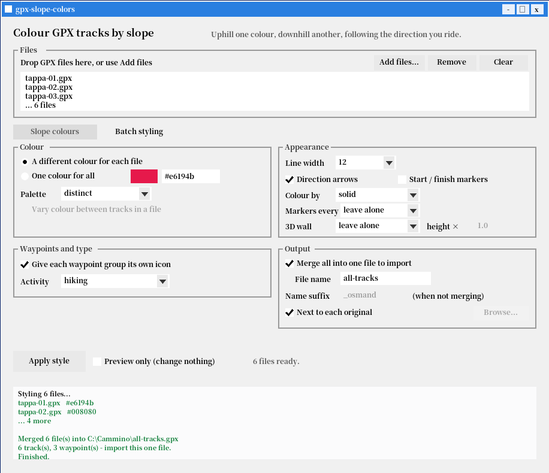

<div align="center">

# gpx-slope-colors

**Colour a GPX track by slope — climbs one colour, descents another —
following the direction you actually travel.**

**And style whole folders of tracks for OsmAnd in one go**, then import them
as a single file with nothing left to configure.

Works in **OsmAnd** (no Pro subscription) and on **Garmin**.
One self-contained executable. No Python, no runtime, no installer.

[](LICENSE)
[](#building-from-source)
[](#tests-and-verification)
[](#installing)


</div>

---

## Why

OsmAnd can colour a track by slope natively, and it does it properly: the
gradient is *signed*, so uphill and downhill are told apart rather than just
"steep vs flat". The catch is that this colouring mode is reserved for
**OsmAnd Pro**.

This tool does the same job from the outside. It reads your GPX, works out
where you are climbing and where you are descending — following the order of
the points, so the result depends on the direction you ride or walk — and
writes the colours *into* the file. Free OsmAnd displays them without
complaint, because per-track colours in a GPX have never been a paid feature.

The track is cut into consecutive `<trk>` blocks, each carrying its own colour.
A useful side effect: because every block is a solid colour, **the direction
arrows stay visible** — they disappear with OsmAnd's own gradient colouring
([issue #21082](https://github.com/osmandapp/OsmAnd/issues/21082)).

## Installing

Grab a build from the [Releases](../../releases) page, or build it yourself —
it takes about five seconds and needs nothing but a C++17 compiler.

| File | Platform |
|---|---|
| `gpx-slope-colors.exe` | Windows app — drag, drop, Convert |
| `gpx-slope-colors-cli.exe` | Windows command line |
| `gpx-slope-colors` | Linux / macOS command line (build from source) |

The Windows executables are statically linked: no DLLs, no admin rights, no
setup program. They run from a USB stick.

## Quick start

```sh
gpx-slope-colors ride.gpx
```

writes `ride_slope.gpx` next to the original — climbs in red, descents in
green, level ground in purple.

Then in OsmAnd: *Menu → My Places → Tracks → Import*, and show the track on
the map. There is nothing to configure inside OsmAnd; the colours travel
inside the file.

**One thing only: when OsmAnd asks how to import, choose "as one track".**
The coloured stretches are separate `<trk>` blocks, and importing as one track
keeps them together with their own colours.

Several files at once are **merged into one `all-tracks.gpx`**, so OsmAnd needs
a single import instead of one per stage — each track keeps its own colours:

```sh
gpx-slope-colors stages/*.gpx
```

Add `--separate-files` if you would rather have one coloured file per input.

A sample track is included if you want to try it straight away:

```sh
gpx-slope-colors demo.gpx
```

### The Windows app

Double-click the `.exe`, drag your GPX files onto the window, press
**Convert**. You can also drop files straight onto the icon, or right-click a
GPX file and pick *Open with*. Presets for road cycling, MTB, hiking and long
routes set sensible values in one click.

The window has **two tabs**: *Slope colours*, described above, and *Batch
styling* for the [second mode](#batch-styling). The file list is shared, so the
same selection feeds either one.


The second tab applies OsmAnd styling to a whole folder — see
[Batch styling](#batch-styling):



## Options

Everything is optional; the defaults are tuned for cycling.

```
  -h, --help             show this help and exit
  -o, --output PATH      output file (single input only; default: next to
                         the input file, with the suffix added)
      --output-dir DIR   write results into DIR instead
      --suffix TEXT      suffix added to the name (default _slope)
      --threshold PCT    gradient % below which a stretch is flat (1.5)
      --window M         metres for smoothing and gradient (50)
      --minlen M         shortest coloured section in metres (80)
      --uphill COLOR     uphill colour: name or #rrggbb (red)
      --downhill COLOR   downhill colour (green)
      --flat COLOR       flat colour (purple)
      --no-flat          no flat class: everything is uphill or downhill
      --split-files      separate files for uphill, downhill and flat,
                         so each can be shown on its own in OsmAnd
      --separate-files   with several inputs, write one output file each
                         (default: merge them into one file to import)
      --merge-name NAME  name of the merged file (default all-tracks.gpx)
      --width W          thin | medium | bold | 1-24 (24 = maximum)
      --no-arrows        do not show direction arrows
      --keep-waypoints   copy <wpt> waypoints into the output
      --markers M        distance markers along the track, every M metres
                         ("off" to remove them). --markers-time S for time
      --3d TYPE          3D wall under the track: altitude | fixed_height.
                         "none" switches off a wall the file already has.
                         Left out entirely, nothing is written at all.
                         Seen best with the map tilted into 3D, though
                         it also shows in 2D at close zoom. Works on
                         the free OsmAnd - no subscription needed
      --3d-scale N       wall height multiplier (default 1.0)
      --3d-wall C        wall colour: solid (default, follows the slope
                         colours) | upward_gradient | downward_gradient
                         | altitude | speed | slope
      --3d-position P    top | bottom | top_bottom   (default bottom)
      --3d-height M      metres, only with --3d fixed_height
      --quiet            print errors only
      --colors           list the colour names and exit
      --version          print the version and exit
      --style ...        batch-apply OsmAnd appearance to whole folders,
                         without recolouring by slope. See --style --help
```

### Examples

```sh
# all defaults -> ride_slope.gpx
gpx-slope-colors ride.gpx

# pick the output name
gpx-slope-colors ride.gpx -o coloured.gpx

# a different suffix -> ride_osmand.gpx
gpx-slope-colors ride.gpx --suffix _osmand

# colours by name, or by hex code
gpx-slope-colors ride.gpx --uphill orange --downhill lightblue
gpx-slope-colors ride.gpx --uphill "#ff8800" --downhill "#0044cc"

# a long route: fewer, longer sections, slightly thinner line
gpx-slope-colors ride.gpx --window 100 --minlen 250 --width 16

# six stages -> ONE stages/all-tracks.gpx to import
gpx-slope-colors stages/*.gpx

# the same, but one coloured file per stage
gpx-slope-colors stages/*.gpx --separate-files

# a whole folder at once, all results in one place
gpx-slope-colors --output-dir coloured *.gpx
```

With **several** input files the results are merged into one `all-tracks.gpx`
next to the first input. With **one** file, or with `--separate-files`, the
output is written **next to the input file**, not in the directory you ran the
command from. An existing output file is overwritten without asking.

### Colours by name

`red` `darkred` `orange` `yellow` `green` `lightgreen` `darkgreen`
`lightblue` `blue` `darkblue` `cyan` `purple` `magenta` `pink` `brown`
`gray` `lightgray` `black` `white` — or any `#rrggbb` code. Italian aliases
(`rosso`, `verde`, `viola`, `azzurro`…) work too. Run `--colors` for the full
list with hex codes.

### Tuning

| Problem | What to change |
|---|---|
| Too many tiny sections | raise `--minlen` first, then `--window` |
| Gentle slopes counted as climbs | raise `--threshold` |
| Flat sections you don't want at all | `--no-flat` |
| Want to show only the climbs on the map | `--split-files`, then display just the `_uphill` file |

Suggested thresholds: **1** for road cycling, **1.5** for MTB and gravel,
**3** for hiking. For routes over 50 km, `--window 100 --minlen 250` keeps the
map readable.

## Batch styling

A second mode, for a different problem: you already have the tracks, and you
just want them to *look right* in OsmAnd without configuring each one on the
phone.

```sh
gpx-slope-colors --style stages --auto-color --width 12 --arrows on
```

This reads every GPX in `stages/`, gives each one its own colour, sets the line
width and the direction arrows, and writes the result as a single
`stages/all-tracks.gpx`. **No GPS point is touched** — only the tags OsmAnd
reads as styling are added.

It is worth it when you have:

- **a walk split into stages**, one file per day, that you want to see as one
  route in distinguishable colours;
- **an archive of tracks** downloaded over the years from different sites, all
  drawn in the same default red.

### What you can set

```
colour
      --color COLOR      one colour for everything: name or #rrggbb
      --auto-color[=M]   a different colour per file (M: stable | sequential)
      --palette NAME     distinct | warm | cool | colorblind
      --per-track-color  vary the colour between tracks inside each file

appearance
      --width W          thin | medium | bold | 1-24
      --arrows on|off
      --start-finish on|off
      --split TYPE       no_split | distance | time
      --split-interval N metres for distance, seconds for time
      --coloring TYPE    solid | speed | altitude

metadata and waypoints
      --activity ID      OsmAnd activity type, e.g. hiking
      --group-by-type    give each waypoint group its own icon and colour,
                         picked from its <type>
      --wpt-icon NAME    one icon for every waypoint
      --wpt-color COLOR
      --wpt-background S circle | square | octagon
      --icons            list the icon names and exit

one file or many
      (default)          merge everything into one file to import
      --merge-name NAME  name of that file (default all-tracks.gpx)
      --separate-files   write one styled file per input instead

input and output
  -r, --recursive        include subfolders
      --out-dir DIR      write results into DIR
      --suffix TEXT      suffix for the new names (default _osmand)
      --in-place         overwrite the originals
      --backup           with --in-place, keep a .bak copy
  -n, --dry-run          show what would happen, write nothing
```

Run `gpx-slope-colors --style --help` for the full list with examples.

### Notes

- **Colour and width work per track. Arrows, start/finish, splitting and the
  waypoint groups are file-wide.** That is OsmAnd's behaviour, not a limit of
  this tool.
- **Import with "import as one track"**, otherwise OsmAnd splits the file and
  the per-track colours are lost. This matters most for the merged file.
- Running the same command twice is harmless: files already carrying the suffix
  are recognised as earlier output and skipped, and the merged file never
  re-reads itself.
- `--coloring slope` is refused: OsmAnd reserves slope colouring for **Pro**.
  Colouring by slope *without* Pro is what this program's other mode does —
  and `altitude` and `speed` are free, so they are allowed here.
- A waypoint sitting exactly on the start or end of a track will be covered by
  OsmAnd's start/finish marker. The tool warns when it happens;
  `--start-finish off` makes the icon visible again.

## Distance markers and the 3D wall

Two OsmAnd display settings that both modes can write, because both are
file-wide tags rather than anything to do with the track data.

Both are **optional in both modes**, with three states rather than two:

| | What it does |
|---|---|
| not asked for *(default)* | no tag is written at all — the file keeps whatever it had |
| `--markers off` / `--3d none` | writes the tag to switch the setting **off** in a file that has it |
| a real value | writes the setting |

The distinction matters: writing "off" by default would stamp a setting onto
every file you convert, which is not what leaving an option alone should do.
In the app each is a dropdown reading *leave alone* / *remove them* / a value.

**Distance markers** put a label along the track every so many metres:

```sh
gpx-slope-colors ride.gpx --markers 1000          # a marker every km
gpx-slope-colors ride.gpx --markers off           # actively remove them
gpx-slope-colors --style tracks --split distance --split-interval 2000
```

**The 3D wall** draws a curtain under the track, its height following the
elevation — the effect you see when you tilt the map into 3D:

```sh
gpx-slope-colors ride.gpx --3d altitude --3d-scale 2
```

> **The wall works on the free OsmAnd** — no subscription needed. It shows at
> its best with the map tilted into 3D, and it is also visible in plain 2D once
> you zoom in far enough. Verified on the device, September 2026.
>
> (OsmAnd's own documentation lists 3D track visualisation as a paid feature.
> That is not what the app actually does with a wall written into the file, so
> the note here follows the device, not the manual.)

By default the wall colour is `solid`, which means **the wall takes each
track's own colour**. In slope mode that matters: the wall under a climb is
the uphill colour and the wall under a descent is the downhill colour, so it
reinforces the slope colouring instead of painting over it. Asking for
`--3d-wall slope` would hand the colouring back to OsmAnd's own gradient —
which is the Pro feature this program exists to avoid.

Bad values are refused before anything is written, because a typo in one of
these tags is silently ignored by OsmAnd and looks exactly like the feature
not working.

## Where the colours show up

The output is standard GPX 1.1 and opens anywhere. Colours are another matter,
because GPX never standardised them — so the file carries a colour tag for each
of the two ecosystems that actually read one.

| App | Colours | Notes |
|---|---|---|
| **OsmAnd** (Android / iOS) | **yes** | reads `<osmand:color>`; line width and arrows too |
| **Garmin BaseCamp** | **yes** | reads `<gpxx:DisplayColor>` |
| **Garmin devices** (Edge, Oregon, GPSMAP…) | **yes** | read `<gpxtrx:DisplayColor>` |
| Strava, Komoot, Gaia GPS, Google Earth | no | track opens fine, drawn in one colour |

**OsmAnd** takes a free-form hex code, so you get exactly the colour you asked
for, plus the line width and the direction arrows. Needs OsmAnd **4.9.10 or
newer**; older versions collapse a multi-track file to a single colour on
import.

**Garmin** uses a closed list: its schema allows only **17 fixed colour names**,
no hex codes. Each colour you pick is matched to the nearest allowed name in
CIELAB space — perceptual distance, because plain RGB distance picks the wrong
family (it put our green on `DarkCyan`). The default red stays `Red` and the
default green becomes `DarkGreen`.

The Garmin tag is written **twice**, under both the `gpxx:` and `gpxtrx:`
prefixes of the same namespace. This is deliberate: BaseCamp writes one, the
handhelds read the other, and a file written by one Garmin product can
otherwise lose its colours in another.

### Sensor data

Per-point `<extensions>` are copied across verbatim, so **heart rate, cadence,
power and temperature survive** the conversion, with the `gpxtpx` and `gpxpx`
namespaces declared in the header.

### Strava and Komoot

**They cannot show these colours, and no GPX file can make them.** A single
track carries a single colour; the colours here exist because the ride is cut
into consecutive tracks, which is precisely what those sites will not accept as
one activity. There is nothing to convert for them — upload your original file,
which this tool never modifies.

## How it works

1. Read every `<trkpt>` in file order — this is what makes the result
   direction-aware.
2. Fill any missing `<ele>` by linear interpolation between known points.
3. Smooth elevations over a sliding window of `--window` metres, so GPS noise
   doesn't create a climb every few seconds.
4. Compute the gradient over the same window and label each point uphill,
   downhill or flat against `--threshold`.
5. Merge runs shorter than `--minlen` into their neighbours.
6. Write one `<trk>` per run, each with its own colour, width and arrow
   setting. Consecutive sections share their junction point, so no gap appears
   between two colours.

The input GPX must contain elevation data to be coloured by slope. A file
without any `<ele>` is **still written out** — in yellow, named
`<track> - no elevation data` — and reported in the log. Dropping it would
quietly lose a track from a merged file, which is worse than an uncoloured
one. (OsmAnd can add the heights: *Analyse on map → Correct altitude*.)

## Building from source

```sh
make          # command line tool   -> gpx-slope-colors
make test     # build and run both test suites (344 checks)
make windows  # Windows .exe, GUI and CLI
make clean
```

On macOS or Linux without `make`, one command is enough:

```sh
sh build.sh
```

Only a C++17 compiler is needed — no CMake, no external libraries, not even a
GPX parsing dependency. The Windows targets cross-compile with mingw-w64
(`sudo apt install mingw-w64`).

```
slope_core.{hpp,cpp}   slope engine: parsing, smoothing, classification
styler_core.{hpp,cpp}  batch styling engine, and the merging
styler_palette.cpp     colour palettes and the waypoint icon table
main_cli.cpp           command line front end (both modes)
styler_cli.cpp         argument handling for --style
main_gui.cpp           native Win32 GUI, two tabs, no framework
test_slope.cpp         slope test suite       (187 checks)
test_styler.cpp        styling test suite     (157 checks)
demo.gpx               sample track
```

## Tests and verification

`make test` runs **344 checks** in two suites. The slope suite covers gradient
sign and direction awareness, section merging, colour parsing, the CIELAB
Garmin mapping, sensor data preservation, and edge cases like missing
elevations and self-closing XML tags. The styling suite covers option
validation, the waypoint icon table, preservation of foreign extensions, and
the merging: GPX 1.1 element order, one root per merged file, colours staying
distinct, and running the same command twice without doubling anything.

Beyond the unit tests, the output has been checked against:

- **the official [GPX 1.1 schema](https://www.topografix.com/GPX/1/1/gpx.xsd)** — valid;
- **[Garmin's GpxExtensions v3 schema](https://www8.garmin.com/xmlschemas/GpxExtensionsv3.xsd)** — every
  `TrackExtension` block valid, every emitted colour name inside the permitted
  enumeration;
- **a reference implementation**, on a real 120 km route with 3,941 points: all
  39 track blocks match, with the same section boundaries and colours.

One honest caveat: the Garmin claim is verified *against Garmin's published
schema*, not on physical hardware. The file is provably well-formed; it has not
been tested on an actual Edge or Oregon unit.

## Licence

MIT — see [LICENSE](LICENSE). Use it, change it, ship it, commercially too.
